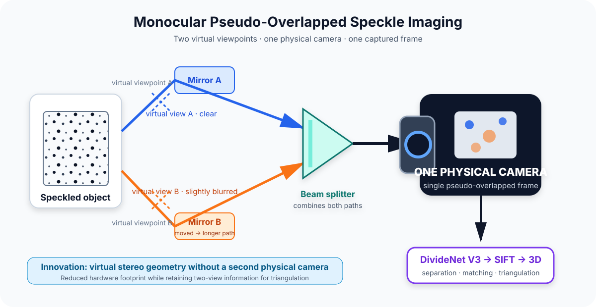

# MonoSpeckle3D

[](README.md)
[](README_CN.md)

A single-camera research pipeline for reconstructing 3D morphology from one pseudo-overlapped speckle image. This repository contains the software implementation developed for the undergraduate thesis *A Morphology Measurement Method Based on Deep Learning Separation of Pseudo Overlapped Images* within a broader research-group effort on pseudo-overlapped imaging and 3D digital image correlation.



The measurement concept uses one physical camera with two reflected virtual optical paths. A beam splitter combines the clear and slightly blurred virtual views into one frame; DivideNet V3 separates them before feature matching and calibrated triangulation. The research direction and optical experiments were developed within the research group, with guidance from the supervisor and assistance from senior group members; this repository focuses on the thesis software pipeline, its organization, and its open-source presentation.

## Measurement Principle: One Camera, Two Virtual Views

MonoSpeckle3D is not a conventional monocular depth-estimation network. Its measurement principle is optical:

- only **one physical camera and one sensor** are required;
- mirrors and a beam splitter create **two virtual viewpoints** of the same speckled surface;
- the two views are optically encoded into **one pseudo-overlapped frame**;
- DivideNet V3 recovers the clear and slightly blurred components;
- the recovered pair retains two-view information for SIFT matching and calibrated triangulation.

This design reduces the camera count, synchronization burden, hardware footprint, and potential system cost while preserving the geometric information required for two-view 3D reconstruction. The achievable accuracy still depends on optical alignment, separation quality, and calibration.

### Optical separation cue

The acquisition system introduces a controlled appearance difference between the two virtual views so that they are not recorded as indistinguishable layers. DivideNet V3 uses independent encoders to learn the resulting clear and softly blurred feature distributions while retaining speckle structure for the following SIFT stage.

This repository documents the software interface and the high-level imaging principle. Detailed optical alignment, path adjustment, component placement, and acquisition procedures are intentionally outside the open-source scope. They depend on the physical apparatus and should be established through an authorized experimental protocol rather than inferred from the example code.

The repository keeps only the final route selected in the thesis. Deblur, StrainNet, SGBM, ICGN, TV-L1, and Lucas-Kanade optical flow were explored during development but are not part of the maintained pipeline.

The original thesis code, including the exploratory routes and historical scripts, is preserved in the [`backup/main-before-paper-refactor-20260918`](https://github.com/lazyerZZZ/MonoSpeckle3D/tree/backup/main-before-paper-refactor-20260918) branch. Use that branch for implementation archaeology or comparison with the refactored main pipeline.

## Scope

Although the project originated as undergraduate thesis code, it implements a complete optical measurement chain whose stages can be inspected and tested independently. It can serve as a foundation for:

- research on pseudo-overlapped imaging, image separation, digital image correlation, and 3D morphology measurement;
- comparisons of separation, feature-matching, displacement-interpolation, and point-cloud algorithms;
- experimental prototypes and feasibility studies for optical measurement systems;
- application-specific industrial development for particular cameras, optical paths, materials, or workpieces.

This repository is a research prototype, not a certified production system. Industrial deployment requires target-specific data collection and calibration, followed by validation of accuracy, repeatability, robustness, runtime performance, error handling, and safety.

## Research Context and Attribution

This project was completed as an undergraduate thesis within a research group working on pseudo-overlapped imaging and 3D-DIC. The overall research direction and optical-system concept were proposed and supervised by the research group. The physical experiments and data acquisition were carried out with substantial assistance from a senior group member. The undergraduate work represented here centers on the image-separation and reconstruction software, experimental analysis, thesis implementation, and subsequent code refactoring for public use.

Accordingly, this repository should not be read as a claim that the complete optical concept was independently originated by the repository author. When using this code or discussing the method, please also consult and cite the related group publications below.

## Related Work

- Z. Chen, X. Li, and H. Li, “Multiple-view 3D digital image correlation based on pseudo-overlapped imaging,” *Optics Letters*, vol. 49, no. 13, pp. 3733–3736, 2024. [https://doi.org/10.1364/OL.529123](https://doi.org/10.1364/OL.529123)
- Z. Jian, X. Shao, and Z. Chen, “PONet: An end-to-end deep learning framework for multi-view 3D-DIC by solving the image overlap problem,” *Optics & Laser Technology*, vol. 199, article 115000, 2026. [https://doi.org/10.1016/j.optlastec.2026.115000](https://doi.org/10.1016/j.optlastec.2026.115000)

The first paper establishes the research group’s pseudo-overlapped multi-view 3D-DIC framework. PONet subsequently addresses overlapped-image separation for synchronous multi-view 3D-DIC. MonoSpeckle3D is an undergraduate-thesis implementation with its own clear/slightly-defocused separation setup and SIFT-based reconstruction route; it should be understood in this shared research context rather than as an isolated claim of priority.

## Acknowledgements

The author thanks the supervisor for proposing and guiding the research direction, and the senior group member who assisted with the optical setup, experiments, and dataset acquisition. The code and dataset are released with the research group’s permission. Their assistance does not imply endorsement of every engineering decision or statement in this repository; any remaining implementation errors are the repository author’s responsibility.

## Pipeline

```text
Raw blended clear blurred triplets
  → split by acquisition group and crop into aligned 256 × 256 patches
  → train DivideNet V3
One pseudo-overlapped speckle image
  → DivideNet V3 separation
Clear and blurred speckle images
  → sparse SIFT matching
Lowe ratio test and RANSAC filtering
  → linear interpolation
Dense horizontal and vertical displacement fields
  → median-deviation and bilateral filtering
  → undistortion and stereo triangulation
  → statistical outlier and depth-range filtering
Final XYZ point cloud
```

SIFT produces sparse matches. Dense displacement fields are generated by the following linear-interpolation stage; SIFT itself is not presented as a dense-disparity method.

## Repository Layout

```text
MonoSpeckle3D/
├── main_reconstruction_pipeline.py     command-line entry point
├── requirements.txt                    Python dependencies
├── configs/
│   └── paper_calibration.example.json  calibration and processing example
├── pseudo_overlap/
│   ├── cli.py                          prepare train and run commands
│   ├── config.py                       configuration loading and validation
│   ├── data.py                         triplet splitting and aligned cropping
│   ├── model.py                        DivideNet V3
│   ├── training.py                     model training
│   ├── separation.py                   tiled full-image inference
│   ├── matching.py                     SIFT RANSAC and interpolation
│   ├── reconstruction.py               filtering triangulation and cleanup
│   └── pipeline.py                     image-to-cloud orchestration
└── tests/
    ├── test_data.py                    data split and crop tests
    └── test_reconstruction.py          triangulation geometry test
```

## Requirements

- Python 3.10
- PyTorch 2.0.1
- NumPy 1.26.4
- OpenCV 4.13.0
- SciPy 1.15.3
- Pillow 12.1.1

Install the dependencies in an isolated environment:

```bash
python -m venv .venv
source .venv/bin/activate
python -m pip install --upgrade pip
python -m pip install -r requirements.txt
```

The program selects an available device in the following order: CUDA, Apple MPS, then CPU.

## Dataset and Model Weights

The thesis appendix provides the dataset and trained weights:

- Baidu Netdisk: [dataset and model weights](https://pan.baidu.com/s/1vp_XkQmVcg5ul4RGRNfglw?pwd=8888)
- Extraction code: `8888`

Place the raw triplets under `data/raw/` and the DivideNet V3 checkpoint under `checkpoints/`. Verify the actual archive layout and filenames before running the commands below.

## Data Format

The `prepare` command reads a directory containing BMP images only. After lexical filename sorting, every three consecutive files must represent:

1. the pseudo-overlapped image, `blended`;
2. the clear speckle image, `clear`;
3. the blurred speckle image, `blurred`.

All three images must have identical dimensions, and the total number of BMP files must be divisible by three.

```text
data/raw/
├── 001_blended.bmp
├── 001_clear.bmp
├── 001_blurred.bmp
├── 002_blended.bmp
├── 002_clear.bmp
└── 002_blurred.bmp
```

The prepared samples follow this naming convention:

```text
{group_id}_{tile_id}_blended.png
{group_id}_{tile_id}_clear.png
{group_id}_{tile_id}_blurred.png
```

They are written to:

```text
data/prepared/
├── train/
├── validation/
├── test/
└── split_manifest.json
```

Acquisition groups are split before cropping, preventing neighboring patches from the same source image from leaking across subsets.

## Usage

The three commands are intended to be used in order: `prepare`, `train`, and `run`.

### 1. Prepare the dataset

```bash
python main_reconstruction_pipeline.py prepare \
  --input data/raw \
  --output data/prepared
```

Fixed settings: a 7:2:1 train/validation/test split, random seed 42, 256 × 256 patches, and stride 256. The generated `split_manifest.json` records the subset assigned to each acquisition group.

### 2. Train DivideNet V3

```bash
python main_reconstruction_pipeline.py train \
  --dataset data/prepared \
  --checkpoints checkpoints
```

Training uses a dual-encoder, dual-decoder DivideNet V3 for 200 epochs, batch size 128, Adam, and an initial learning rate of `2e-4`. The learning rate is halved after 10 epochs without validation improvement. The best checkpoint is saved as `checkpoints/best_model_v3.pth`.

The loss contains pixel MSE, pixel L1, a mixed-image reconstruction constraint, and a mask-based exclusion constraint. The relation `predicted_clear + predicted_blurred ≈ blended` is treated as a simplified reconstruction constraint, not strict conservation of energy.

### 3. Run the complete reconstruction

Copy and review the calibration example:

```bash
cp configs/paper_calibration.example.json configs/calibration.json
```

Update it with the intrinsics, distortion coefficients, relative pose, and valid depth range for the actual experiment, then run:

```bash
python main_reconstruction_pipeline.py run \
  --input data/mixed.bmp \
  --checkpoint checkpoints/best_model_v3.pth \
  --config configs/calibration.json \
  --output outputs/reconstruction
```

- `--input`: one pseudo-overlapped grayscale image;
- `--checkpoint`: trained DivideNet V3 weights;
- `--config`: camera calibration, SIFT, and filtering parameters;
- `--output`: output directory.

The command performs separation, SIFT matching, RANSAC filtering, interpolation, displacement filtering, triangulation, and point-cloud cleanup in one sequence.

## Outputs

```text
outputs/reconstruction/
├── clear.png             separated clear image
├── blurred.png           separated blurred image
├── raw_disp_u.npy        interpolated horizontal displacement
├── raw_disp_v.npy        interpolated vertical displacement
├── filtered_disp_u.npy   filtered horizontal displacement
├── filtered_disp_v.npy   filtered vertical displacement
└── point_cloud.xyz       final point cloud
```

Each line in `point_cloud.xyz` stores one point as `X Y Z`.

## Configuration

[paper_calibration.example.json](configs/paper_calibration.example.json) contains:

- `calibration`: camera intrinsics, distortion, relative rotation, and translation;
- `matching`: SIFT feature count, Lowe ratio threshold, RANSAC threshold, and minimum match count;
- `filtering`: median, bilateral, ROI, depth-range, and statistical-outlier parameters.

The values correspond to the thesis version and document the configuration format. New acquisitions require calibration from their own physical setup.

## Tests

```bash
python -m unittest discover -s tests -v
python -m compileall -q pseudo_overlap tests main_reconstruction_pipeline.py
```

The tests verify group-level split isolation, aligned triplet cropping, and triangulation under known stereo geometry. They are software unit tests, not a model-performance evaluation. A batch command for PSNR, SSIM, and MSE on the complete test subset is not yet included.

## Limitations

- The repository itself does not contain the dataset or weights; they are distributed through the link above.
- Batch PSNR, SSIM, and MSE evaluation is not yet implemented.
- The source images and complete calibration package needed to reproduce the final thesis point cloud are not bundled.
- Detailed optical alignment and acquisition procedures are not part of the open-source release.
- Calibration, ROI, and valid depth range depend on the physical setup.

The code supports inspection and validation of the processing logic and reconstruction geometry. The repository alone is not sufficient evidence that the quantitative thesis results or final experimental point cloud have been reproduced.
